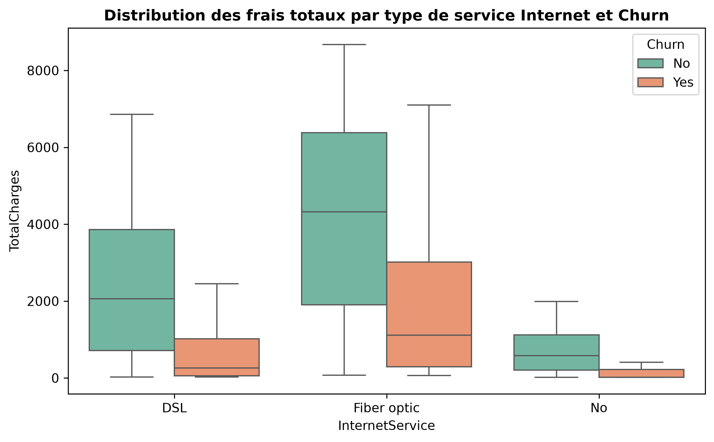
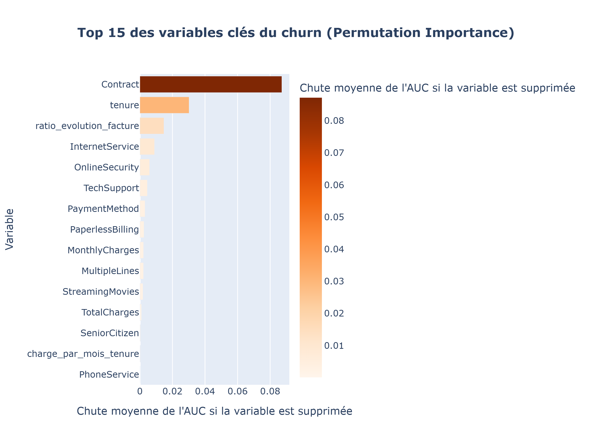
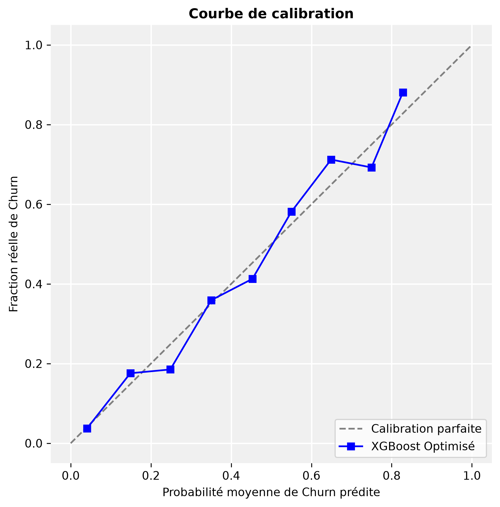
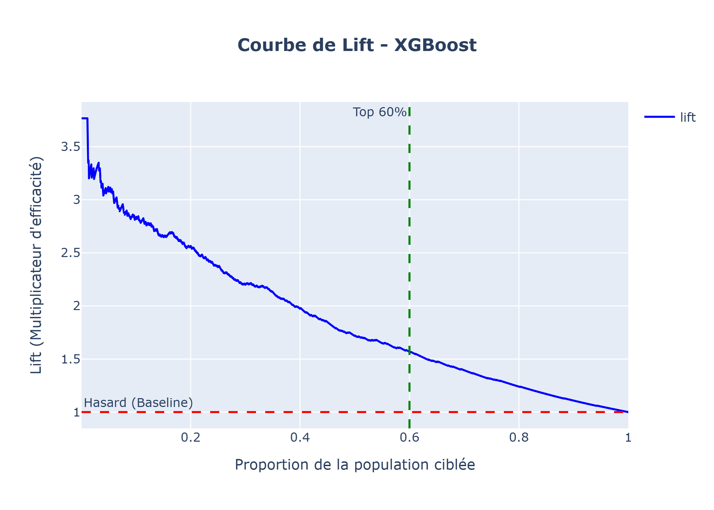

    <h1 style="font-size: 36px; color: #1a3a5f; margin-bottom: 20px;">
        Scoring de churn client - Telco Customer Churn
    </h1>
    <h3 style="font-size: 20px; color: #555; font-weight: normal; margin-bottom: 100px;">
        Rapport d'analyse prédictive
    </h3>
    

        <strong>Auteur :</strong> Nawal CHERFI 
        <strong>Date :</strong> Août 2026 
    

<!-- Saut de page pour séparer la page de garde du reste -->

**Table des matières**
- [Introduction et problématique](#introduction-et-problématique)
- [Objectifs du projet et méthodologie](#objectifs-du-projet-et-méthodologie)
- [1. Analyse Exploratoire des Données (EDA)](#1-analyse-exploratoire-des-données-eda)
- [2. Démarche et feature engineering](#2-démarche-et-feature-engineering)
- [3. Résultats du XGBoost et comparaison avec la baseline (Régression Logistique)](#3-résultats-du-xgboost-et-comparaison-avec-la-baseline-régression-logistique)
- [4. Facteurs de churn et importance par permutation](#4-facteurs-de-churn-et-importance-par-permutation)
- [5. Diagnostic de la calibration et Brier score](#5-diagnostic-de-la-calibration-et-brier-score)
- [6. Optimisation financière du seuil de décision](#6-optimisation-financière-du-seuil-de-décision)
- [7. Stratégie de ciblage et courbe de lift](#7-stratégie-de-ciblage-et-courbe-de-lift)
- [8. Portrait-robot du segment à risque (top 60% / proba = 12%)](#8-portrait-robot-du-segment-à-risque-top-60-proba-12)
- [Conclusion et recommandations business](#conclusion-et-recommandations-business)
<!-- Saut de page pour séparer la page de garde du reste -->

# Introduction et problématique
Dans le secteur des télécommunications et des services numériques, marqué par une forte concurrence, l'attrition des clients est une préoccupation majeure pour les entreprises. Ces dernières déploient des moyens considérables pour fidéliser leur base clientèle et rester compétitives.  
Dans ce projet nous nous intéressons à un opérateur télécom mobile présent en Europe appelé "TelcoWave". La direction « Customer Success » nous confie un enjeu prioritaire : réduire le churn (résiliations) au prochain trimestre. 

# Objectifs du projet et méthodologie
Notre objectif est de constuire un modèle de "scoring", capable d'estimer la probabilité de "Churn" pour chaque client, afin de prioriser les actions sur les clients les plus à risque, avec un budget marketing limité.  
Notre travail s'articule autour de deux éléments :
* **Explicabilité des facteurs** : déterminer avec précision les variables qui
déclenchent le départ.
* **Rentabilisation du plan de rétention** : minimiser les coûts marketing en évitant d'offrir des promotions massives à des clients qui n'avaient pas l'intention de se désabonner.  

Notre choix s'est porté sur l'algorithme de machine learning XGBoost, pour sa puissance et sa précision.
Ce rapport présente l'intégralité des résultats, analyses d'interprétabilité et arbitrages stratégiques issus de l'étude prédictive de l'attrition client.

**Jeu de données**  
Le jeu de données fourni est un extrait anonymisé de TelcoWave (un enregistrement par 
client). Il contient des informations démographiques, des services souscrits, des informations contractuelles et de la facturation (tenure, MonthlyCharges, TotalCharges).  
**Variable cible** : Churn (Yes/No) - 'Yes', si le client a résilié dans la dernière période observée. 'No', sinon.  
**Format** : CSV à récupérer dans le répertoire "data/" du projet ou sur Kaggle (Telco Customer Churn).  
Le fichier contient 7043 lignes et 21 colonnes (variables).

<!-- Saut de page pour séparer la page objectif et méthodologie des autres pages -->

# 1. Analyse Exploratoire des Données (EDA)
Avant toute modélisation, une analyse exploratoire approfondie a été menée pour identifier les clients à risque.  
Le taux de Churn est plus élevé chez les abonnés ayant souscrit à la **fibre optique**, payant par **chèque électronique**, et avec un engagement contractuel **Mois par Mois**.  
Le graphique ci-dessous par exemple montre que le risque d'attrition (*Churn: Yes*) est fortement concentré chez les clients ayant la fibre et qui sont sur des tranches de facturation très élevées. Le départ de ces clients s'effectue au début de leur abonnement (faible ancienneté).

<figure style="text-align: center;">
  
  <figcaption><i>Figure 1 : Distribution des frais totaux cumulés selon le type de service Internet et le statut d'attrition.</i></figcaption>
</figure>

# 2. Démarche et feature engineering
Pour capturer les signaux comportementaux des clients, le jeu de données initial a été enrichi par la création de variables spécifiques. Afin de garantir la robustesse de cette approche, un protocole rigoureux a été mené :
* **Séparation des variables (Train/Test) :** la séparation 80% Train / 20% Test a été effectuée à la racine pour sanctuariser le jeu de test et éliminer tout risque de *Data Leakage*.
* **Standardisation des données :** nous avons intégré un ColumnTransformer appliquant un OneHotEncoder sur les variables catégorielles et un StandardScaler sur les variables numériques. Les échelles de nos variables étant déjà bien proportionnées et sans écarts extrêmes, une transformation logarithmique n'était pas nécessaire. Le StandardScaler suffit à harmoniser parfaitement les échelles pour nos modèles.
* **Sélection par RFECV (Recursive Feature Elimination with Cross-Validation):** sur les 54 variables générées après encodage, l'algorithme a automatiquement rejeté 16 colonnes redondantes (dont l'indicateur de valeurs manquantes 'a_totalcharges_is_missing'), et gardé **38 variables prédictives**. 
  
Nous avons par la suite utilisé la régression logistique comme modèle baseline et amélioré après nos résultats avec un modèle non linéaire (XGBoost).

# 3. Résultats du XGBoost et comparaison avec la baseline (Régression Logistique)
L'algorithme XGBoost a été utilisé dans un premier temps avec ses hyperparamètres par défaut (à l'exception du paramètre 'n_estimators' fixé à 80) et a abouti aux résultats suivants :  

* **Sur le Train (AUC = 0,9868)** : l'algorithme a appris les données d'entraînement quasiment par cœur, créant des règles ultra-spécifiques pour chaque client.  
* **Sur le Test (AUC = 0,8184)** : face à des données inconnues par l'algorithme, les règles apprises n'ont pas fonctionné. Le score a chuté lourdement à 0,8184.  
  
Une recherche d'hyperparamètres intensive ('RandomizedSearchCV', durée : 30min 53sec) a permis de stabiliser le modèle XGBoost.  
Les configurations retenues sont :
* **'max_depth = 3'** : limite la profondeur des arbres pour capturer uniquement les règles macro et éviter l'apprentissage par cœur.
* **'learning_rate = 0.05'** : ralentit la vitesse d'apprentissage pour garantir une convergence prudente et robuste.
* **'n_estimators = 100'** : fixe le nombre d'arbres à un seuil optimal avant l'apparition du surapprentissage (*overfitting*).
* **'subsample = 1.0'** : entraîne chaque arbre sur l'intégralité des individus disponibles, le contrôle du surapprentissage étant déjà pleinement assuré par la faible profondeur des arbres ('max_depth').

Comparé à la Régression Logistique (Baseline) sur le jeu de test, les scores d'AUC du modèle XGBoost confirment une excellente robustesse globale :

* **Régression Logistique (Baseline) :** AUC = **0.8413**
* **XGBoost Optimisé (Final) :** AUC = **0.8463**  

L'écart technique de seulement 0.005 (0.5 %) place les deux modèles au même niveau en matière de capacité de classement. La différenciation majeure entre les deux algorithmes s'opérera sur la calibration.
La recherche d'hyperparamètres via 'RandomizedSearchCV' a permis d'aboutir à un gain net de **+2,8 points** sur le jeu de test (0,8184 vs 0,8463).

<figure style="text-align: center;">
  
  <figcaption><i>Figure 2 : Courbes ROC</i></figcaption>
</figure>
Dans la zone où le taux de Faux Positifs (FP) se situe entre 10 % et 30 % (axe X), la courbe bleue du XGBoost se détache très légèrement au-dessus de la courbe rouge (Régression logistique). Cela indique que pour un niveau de fausses alertes modéré, le XGBoost intercepte un volume de vrais churneurs légèrement supérieur à la Baseline.

# 4. Facteurs de churn et importance par permutation

Nous avons appliqué la méthode de la *Permutation Importance* sur le jeu de test pour identifier les variables qui ont le plus fort pouvoir explicatif sur le départ de nos clients.

<figure style="text-align: center;">
  <!-- Remplacez par le nom réel de votre fichier image -->
  
  <figcaption><i>Figure 3 : Top 15 des variables explicatives du churn par Permutation Importance.</i></figcaption>
</figure>

L'évaluation de la baisse de l'AUC sur le jeu de test met en lumière le **top 3 des variables clés** décisionnels  :
* **Type de contrat :** le facteur structurel majeur d'engagement.
* **Tenure (ancienneté) :** l'historique du client.
* **Ratio évolution facture :** la variable financière créée lors du 'Feature Engineering' s'impose avec l'ancienneté et le type du contrat, prouvant que les variations ou hausses tarifaires sont des éléments déclencheus du churn.

# 5. Diagnostic de la calibration et Brier score
Pour valider l'utilisation commerciale directe des probabilités calculées, la calibration a été mesurée sur l'échantillon de test indépendant :
* **Brier score de la baseline :** 0.1688
* **Brier score XGBoost :** **0.1354** *(Plus proche de 0, donc significativement plus précis)*.  

L'analyse visuelle confirme que la courbe de calibration de **XGBoost** est très proche de la diagonale (qui représente la calibration parfaite). Ses probabilités de risque sont mathématiquement fiables. Au vu de la qualité native du modèle optimisé, **aucun recalibrage post-processing n'est nécessaire**.

<figure style="text-align: center;">
  <!-- Remplacez par le nom réel de votre fichier image -->
  
  <figcaption><i>Figure 4 : Courbe de calibration du modèle XGBoost</i></figcaption>
</figure>
<!-- Saut de page pour séparer la page de garde du reste -->

# 6. Optimisation financière du seuil de décision
Sous la contrainte économique d'une campagne de rétention client (coût de l'offre = 15 €, valeur sauvée = 120 €, soit un ratio asymétrique de 1 sur 8), deux stratégies ont été simulées sur le jeu de test :
* **Stratégie A (approche ROI) :** l'optimisation du profit fixe le seuil de déclenchement à **12 % de probabilité de churn**. À ce niveau, le profit net maximal généré atteint **29.56 k€**. Augmenter ce seuil fait diminuer le profit car le coût de l'inaction (perdre 120 €) écrase le coût du faux positif (gâcher 15 €).
* **Stratégie B (approche budgétaire) :** le tri des clients par risque décroissant montre que pour capter ce profit maximal de 29.56 k€, l'entreprise doit cibler exactement le **Top 60 % des clients les plus instables**. (voir Figure 6).

Le Top 60 % des clients à risque correspond très exactement à la population affichant une probabilité de churn supérieure ou égale à 12 % (proba >= 0.12). Les deux stratégies convergent vers le même valeur.

<figure style="text-align: center;">
  <!-- Remplacez par le nom réel de votre fichier image -->
  
  <figcaption><i>Figure 5 : Courbe top k% du modèle XGBoost</i></figcaption>
</figure>

# 7. Stratégie de ciblage et courbe de lift
* **Au point optimal (Top 60 %)** : le modèle affiche un lift d'environ **1.6**, c'est le point d'équilibre parfait pour optimiser le budget marketing tout en capturant **96 %** de la totalité des résiliations du dataset (voir la figure 6).
Le lift de 1.6 signifie qu'en ciblant ce Top 60 % trié par XGBoost, la campagne marketing est 1.6 fois plus efficace qu'un ciblage au hasard.  
Au lieu de retenir seulement 60 % des churners (comme le ferait le hasard), nous allons avoir :   
'60 % de la population x 1.6 (lift) = 96 % de la totalité des churners'

<figure style="text-align: center;">
  <!-- Remplacez par le nom réel de votre fichier image -->
  
  <figcaption><i>Figure 6 : Courbe de lift du modèle XGBoost</i></figcaption>
</figure>

# 8. Portrait-robot du segment à risque (top 60% / proba >= 12%)

| Segment Marketing | Tenure (mois) | Facture Mensuelle (€) | Facture Totale (€) | Ratio Évol. Facture | Contrat Mensuel (%) | Contrat 1 An (%) | Contrat 2 Ans (%) |
| :--- | :---: | :---: | :---: | :---: | :---: | :---: | :---: |
| **Ne pas cibler (Fidèle)** | 48.2 | 51.63 | 2 822.36 | 1.01 | 7.8 | 34.3 | 57.8 |
| **À cibler (Risque >= 12%)** | 21.5 | 72.02 | 1 815.94 | 1.21 | 84.8 | 13.0 | 2.2 |

Le segment ciblé par la campagne se caractérise par :
* **Le facteur contractuel :** le segment à risque est massivement dominé par les contrats **Mois par Mois (84.8 %)**, tandis que le segment sécurisé (churn = 'No') est caractérisé par des engagements d'un ou deux ans (92.1 %).
* **Le comportement financier :** les clients à risque affichent une ancienneté (tenure) moyenne de 21.5 mois et un 'ratio_evolution_facture' supérieur à 1.0, prouvant qu'ils subissent une instabilité tarifaire sur une période de fidélité encore fragile.
Les frais menseuls moyens sont également elevé (72.02).
<!-- Saut de page pour séparer la conclusion du reste -->

# Conclusion et recommandations business
Le modèle **XGBoost** est officiellement validé. Il surpasse la baseline sur la précision des probabilités (Brier score de 0.1354) et offre une rentabilité maximale sécurisée.

**Actions à privilégier :**
* Déclencher l'envoi automatisé du coupon de 15 € dès qu'un client franchit la barre des **12 % de risque** calculée par le pipeline, en ciblant prioritairement les profils sans engagement (contrat mensuel) subissant une hausse de tarification récente.
* Le but de la campagne de rétention ne doit pas seulement être d'offrir une réduction passive. L'objectif doit être de **convertir les clients Month-to-month à risque vers des contrats avec engagement d'un an**, en utilisant le coupon de 15 € comme levier de négociation. Passer un client du contrat mensuel au contrat annuel réduit le risque du churn.

